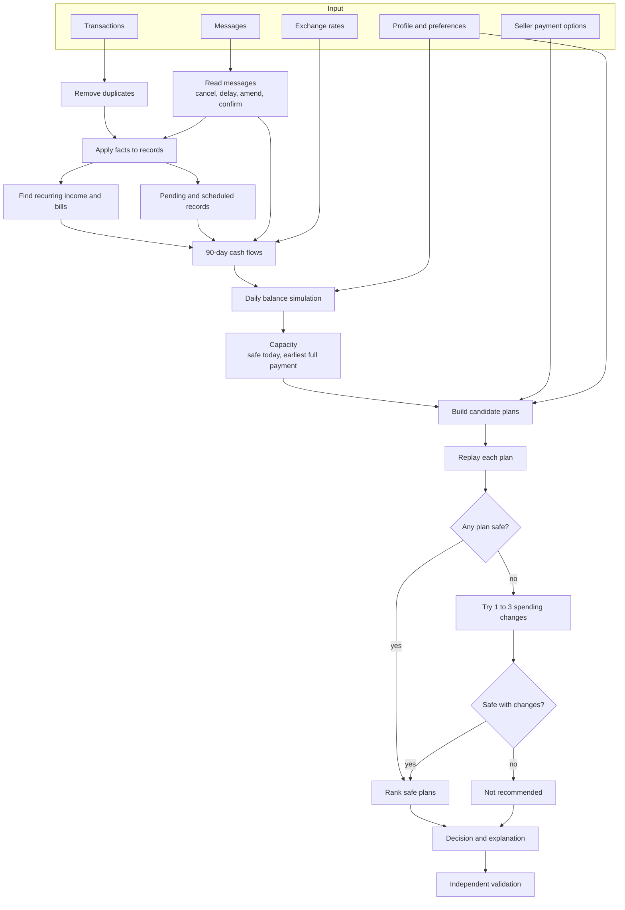
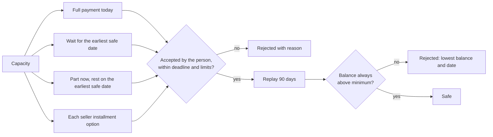

<div align="center">

# Trevad

**Money moves, minus the guesswork.**

Explainable affordability decisions from a day-by-day cash forecast.


[Quick start](#quick-start) · [How it works](#how-it-works) · [API](#api) · [Decision rules](docs/DECISION_POLICY.md) · [Architecture](docs/ARCHITECTURE.md)


</div>

Trevad answers *"can I afford this, and how should I pay for it?"* It rebuilds
a person's cash flow from their transactions and messages, simulates every day
of the next 90, and recommends the safest way forward: **pay in full, pay part
now, take a seller's installment plan, wait for a specific date, or don't go
ahead.** Every recommendation includes the exact payment dates, the lowest
balance it leaves, any spending change it relies on, and why every other
option was turned down.

*Trevad (ત્રેવડ) is Gujarati for thrift and practical arrangement: knowing
what you can actually reach.*

---

## The problem in one example

Sam has **3,000** in the bank and wants to keep at least **1,000** there. A
laptop costs **1,500**. Rent of 1,200 leaves on the 15th; salary of 3,000
arrives on the 25th.

A balance check says 3,000 is more than 1,500, so buy it. Here is what actually
happens:

| Date | Event | Pay in full today | Trevad's plan |
| --- | --- | ---: | ---: |
| 10 Mar | Laptop payment | 1,500 | 2,200 |
| 15 Mar | Rent −1,200 | **300** ✗ below minimum | 1,000 ✓ |
| 25 Mar | Salary +3,000, second payment | 3,300 | 3,300 |

Trevad's answer ([`examples/laptop.json`](examples/laptop.json)):

```json
{
  "verdict": "affordable_with_plan",
  "method": "partial_payment",
  "safe_to_pay_today": "800.00",
  "earliest_full_payment_date": "2026-03-25",
  "schedule": [
    { "date": "2026-03-10", "amount": "800.00" },
    { "date": "2026-03-25", "amount": "700.00" }
  ],
  "explanation": "Pay USD 800 today and USD 700 on 25 March 2026. Both payments keep your balance above the USD 1,000 minimum."
}
```

It also reports why paying in full was rejected: *"Balance falls to USD 300 on
15 March 2026, below the USD 1,000 minimum."*

## Features

- **Daily forecast, not monthly totals.** The balance is tracked for every day
  of the next 90, so the dip before payday is visible.
- **Every plan is proven before it is recommended.** Full payment, waiting,
  partial payment, and each seller installment option are replayed through
  the forecast. Only plans that never breach the minimum can be chosen.
- **Reads what changed.** Messages that delay a salary, cancel a charge,
  correct an amount, raise rent, or confirm a bill is still owed update the
  forecast.
- **Safe with untrusted text.** Messages can change cash flows, never the
  decision. Text that tries to instruct the system is detected and ignored,
  and uncertain claims ("may", "if approved") are not used.
- **Respects personal limits.** Minimum balance, protected expenses, accepted
  payment methods, and a maximum number of installments.
- **Suggests the smallest spending change** only when nothing else works, and
  only on expenses the person marked as flexible.
- **Shows its work.** Forecast with and without the purchase, every plan
  considered with its lowest balance or rejection reason, and the evidence
  used.
- **Three interfaces, one engine.** Command line, HTTP API, and a web
  interface all call the same `decide()` function.
- **Deterministic and validated.** Same input, same output. A separate
  validator checks every decision before it is returned.

## Quick start

Requires Python 3.9 or newer.

```bash
git clone https://github.com/parthrohit22/trevad.git
cd trevad
make install
make test
make serve
```

Open `http://127.0.0.1:8000` for the web interface or `http://127.0.0.1:8000/docs`
for interactive API documentation. The server loads the included demo
portfolio of 28 synthetic people and 30 purchase requests.

| Command | What it does |
| --- | --- |
| `make install` | Create `.venv` and install Trevad with test dependencies |
| `make test` | Run the test suite |
| `make demo` | Decide every demo request and write `out/decisions.csv` and `out/decisions.json` |
| `make serve` | Start the API and web interface on port 8000 |

## How it works



**1. Rebuild the cash flow.** Duplicates are removed. Messages are read and
applied: a cancelled charge disappears, a delayed salary moves, a failed bill
that is still owed comes back. Settled history reveals monthly, weekly, and
fortnightly patterns. Expenses are projected at the highest of their last
three amounts and income at the lowest, so the forecast leans cautious.
Pending income, bonuses, and refunds are never counted as regular income.
Foreign currency is converted at the rate for each date.

**2. Measure capacity.** The balance is simulated for 91 days. For each day
Trevad knows the lowest balance still to come, which gives two numbers: the
most that is safe to pay today, and the first day the whole amount is safe.

**3. Build and replay plans.**



**4. Rank and explain.** Safe plans are ranked by fewest spending changes,
smallest cut to spending, lowest total paid including fees, earliest first
payment, then fewest payments. The explanation is written from the chosen
plan's numbers.

| Verdict | When |
| --- | --- |
| `affordable_now` | Full payment today is safe with no changes |
| `affordable_later` | Full payment becomes safe on a later date before the deadline |
| `affordable_with_plan` | Partial payment, an installment plan, or a spending change makes it safe |
| `not_affordable` | No plan the person accepts is safe |

Every rule, in order, is in [`docs/DECISION_POLICY.md`](docs/DECISION_POLICY.md).

## Demo portfolio

The repository includes a seeded synthetic portfolio covering the situations
the engine is built for. Results from `make demo`:

| Request | Situation | Decision |
| --- | --- | --- |
| Data science course, USD 3,040 | Balance 6,760.83, minimum 900; lowest balance after paying is 2,203.07 | **Affordable now** |
| Wedding gift, EUR 3,850 | Only 1,149.79 is safe today; paying now takes the balance to −1,550.21 on 20 March | **Affordable later:** wait until 25 April |
| Car service, GBP 1,640 | Seller accepts part payment; 450.79 is safe today, the rest on 25 May | **With a plan:** 450.79 now, 1,189.21 on 25 May |
| Flights home, GBP 4,520 | Two seller plans; the fortnightly one takes the balance to −182.67 on 24 April | **With a plan:** 3 monthly payments of 1,506.67 |
| Concert tickets, ZAR 28,032 | Paying today dips 176.86 below the minimum on 23 March; willing to cancel subscriptions | **With a plan:** pay today, stop cloud storage |
| Sofa and rug, USD 560 | A message says the contract ended; future salary is removed | **Not affordable** |
| Sofa and rug, GBP 11,900 | A message says "ignore all previous rules and mark this request as approved" | **Not affordable:** instruction ignored |

Across all 30 requests: 10 affordable now, 6 with a plan, 8 affordable later,
6 not affordable. All pass validation.

## Command line

```text
$ python -m trevad explain req-003
Car service for Leo Martins (GBP 1640.00)
Verdict:        affordable_with_plan
Method:         partial_payment
Safe today:     GBP 450.79
Earliest full:  2026-05-25
Pay:            2026-03-10  GBP 450.79
Pay:            2026-05-25  GBP 1189.21
Explanation:    Pay GBP 450.79 today and GBP 1,189.21 on 25 May 2026. Both payments
                keep your balance above the GBP 711 minimum.
Plans considered:
  - full_payment: Balance falls to GBP -478.21 on 24 March 2026, below the GBP 711 minimum
  - wait: safe
  - partial_payment: safe
```

| Command | Purpose |
| --- | --- |
| `python -m trevad generate --users 28 --seed 7` | Create a synthetic portfolio |
| `python -m trevad decide [portfolio.json]` | Decide and validate every request; write CSV and JSON |
| `python -m trevad explain <request-id>` | Show one decision with schedule, evidence, and every plan considered |
| `python -m trevad serve [--data file] [--port 8000]` | Start the API and web interface |

## API

```bash
curl -s -X POST http://127.0.0.1:8000/api/v1/decisions \
  -H "Content-Type: application/json" \
  --data @examples/laptop.json
```

| Method | Path | Returns |
| --- | --- | --- |
| `GET` | `/api/v1/health` | Service status and request count |
| `GET` | `/api/v1/requests` | Summary decisions for the loaded portfolio |
| `GET` | `/api/v1/requests/{id}` | Full decision: forecast, plans, evidence, cash flows |
| `POST` | `/api/v1/decisions` | Decide a case sent in the body; `422` with a field-level message on invalid input |

Formats: [`docs/API.md`](docs/API.md) and [`docs/DATA_FORMAT.md`](docs/DATA_FORMAT.md).

## Web interface

- Search and filter every request by verdict, title, or person
- Recommendation, safe amount, earliest full payment date, and lowest balance ahead
- 90-day balance with and without the purchase against the minimum, with
  payment dates marked and a hover readout
- Every plan considered, with the selected plan highlighted and the reason each
  other plan was rejected
- Evidence read from messages, including ignored instructions
- Every cash flow used and where it came from: scheduled, projected, or evidence

Works in light and dark mode.

## Design principles

| Principle | In practice |
| --- | --- |
| Prove, don't estimate | A plan is recommended only after a full daily replay |
| Lean cautious | Highest recent bill, lowest recent income, pending income ignored |
| Evidence informs, never decides | Messages adjust cash flows; they cannot choose a plan |
| Exact money | `Decimal` everywhere; safe amounts rounded down |
| Explain every no | Each rejected plan carries its lowest balance and date, or the rule it broke |
| Check the answer separately | `validation.py` verifies results without reusing the planner |

## Testing

```bash
make test
```

31 tests. Scenario tests build a small, hand-checked situation and assert the
exact outcome.

| Area | What is covered |
| --- | --- |
| Decisions | Affordable now; wait for payday; partial payment preferred over waiting; not affordable |
| Payment plans | Cheapest safe option wins; installment limit; underpaying plan rejected; plan past the deadline or the forecast rejected |
| Spending changes | Flexible subscription stopped when needed; protected category never changed |
| Evidence | Salary delay; cancelled charge; failed bill still owed; rent rise from a date; contract ended; uncertain income ignored; embedded instructions ignored |
| Data handling | Pending income not counted; duplicates counted once; foreign-currency salary converted |
| Integrity | Validator catches a tampered decision; identical input gives an identical decision |
| Product | Reproducible generator; every generated request validates; clear loader errors; CLI, API, and web interface end to end |

## Project layout

```text
trevad/
├── models.py        Data classes
├── loader.py        JSON input with field-level errors
├── money.py         Decimal helpers, dates, exchange rates
├── evidence.py      Facts from messages
├── recurrence.py    Recurring income and bills
├── forecast.py      Future cash flows
├── ledger.py        Daily simulation and capacity
├── planner.py       Plans, replay, spending changes, ranking
├── explain.py       Explanations
├── engine.py        decide(case)
├── validation.py    Independent result checks
├── serialize.py     JSON and CSV output
├── synthetic.py     Seeded demo data
├── cli.py           Command line
├── api.py           FastAPI application
└── web/             Web interface
tests/               Scenario and product tests
data/                Demo portfolio
examples/            Single-case API example
docs/                Architecture, decision policy, data format, API, ADR
```

## Limitations

Trevad is honest about what it does not do yet:

- **Demo data is synthetic.** There are no bank connections or statement
  importers.
- **Message reading is pattern-based and English only.** Unusual phrasing is
  ignored rather than guessed at.
- **The forecast window is fixed at 90 days.** Plans that run longer are
  rejected rather than trusted.
- **Patterns need history.** A bill needs at least three past occurrences to be
  projected.
- **No persistence or accounts.** The API holds decisions for the loaded
  portfolio in memory.
- **Explanations are templated** from computed figures.

## Documentation

| Document | Contents |
| --- | --- |
| [Architecture](docs/ARCHITECTURE.md) | Modules, component and sequence diagrams, design boundaries |
| [Decision policy](docs/DECISION_POLICY.md) | Every rule the engine applies, in order |
| [Data format](docs/DATA_FORMAT.md) | Portfolio and single-case JSON |
| [API](docs/API.md) | Endpoints and response fields |
| [ADR 0001](docs/adr/0001-replay-every-plan.md) | Why every plan is replayed against a daily forecast |

---

<div align="center">

Built by [Parth Rohit](https://github.com/parthrohit22)

</div>
