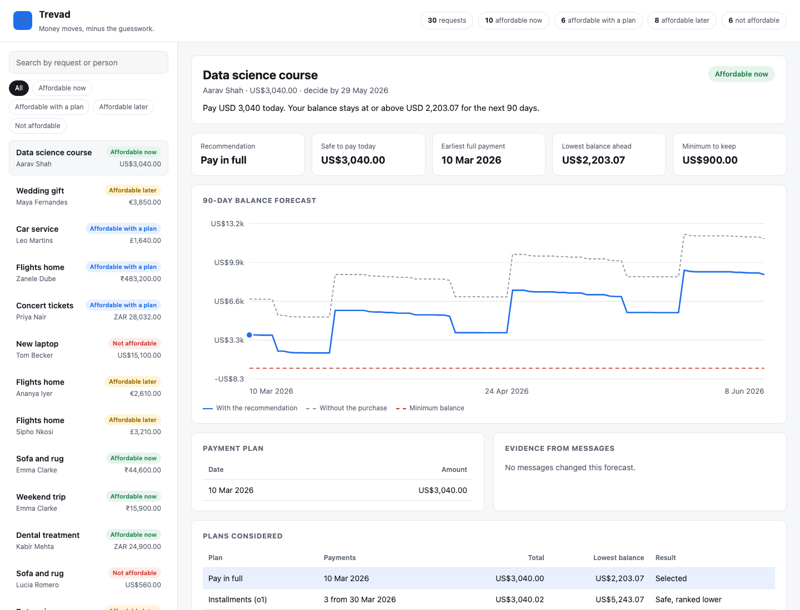
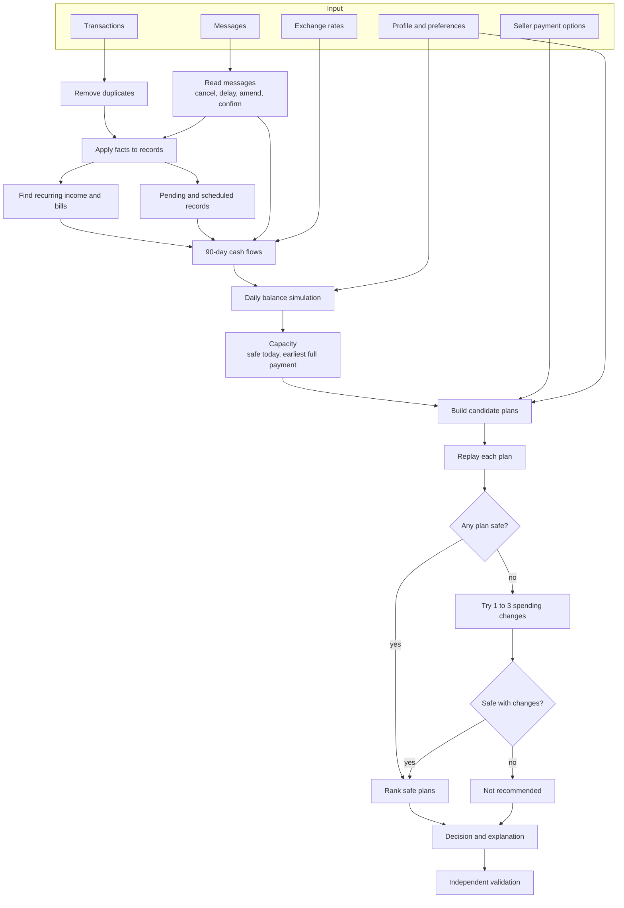
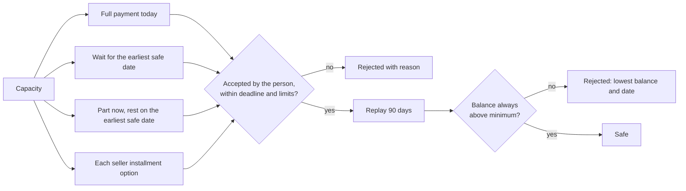

# Trevad


**Money moves, minus the guesswork.**

Trevad answers one question well: *can I afford this, and how should I pay for
it?* It rebuilds a person's cash flow from their transactions and messages,
simulates every day of the next 90, and recommends the safest way forward: pay
in full, pay part now, take a seller's installment plan, wait for a specific
date, or don't go ahead. Every recommendation comes with the exact payment
dates, the lowest balance it leaves, any spending change it depends on, and
the reasons every other option was turned down.

*Trevad (ત્રેવડ) is Gujarati for thrift and practical arrangement: knowing
what you can actually reach.*

```text
Transactions + Messages + Preferences + Payment options
                         |
             Clean, read evidence, find patterns
                         |
              90-day day-by-day balance forecast
                         |
        Build every plan  ->  replay each one  ->  rank
                         |
     Recommendation + schedule + proof + explanation
```



## The problem

Checking the price against today's balance gets the answer wrong in exactly
the cases that matter.

Two people each have 3,000 in the bank and want a 1,500 laptop. The first has
rent of 1,200 due in five days and salary in fifteen. The second was just told
by their employer that salary is delayed a week. A balance check says yes to
both. For the first person, paying today breaks their safety buffer until
payday. For the second, even waiting until payday is not enough.

Getting this right means combining information that is scattered and often
contradictory:

- recurring bills and income mixed in with one-off purchases and refunds
- pending, scheduled, failed, and cancelled records that count differently
- duplicate records of the same charge
- messages that delay a salary, cancel a booking, or confirm a bill is still
  owed
- income in another currency
- seller payment plans with different dates, frequencies, and fees
- personal limits: a minimum balance, expenses that must never be cut, payment
  methods the person will and won't use

## How Trevad is different

**It plans in days, not in totals.** A monthly budget can look healthy while
the account dips below zero for three days before payday. Trevad tracks the
balance for every day and finds the lowest point.

**Every plan is replayed before it is recommended.** Trevad generates every
plan the person would accept and runs each one through the full forecast. A
plan is only eligible if the balance never falls below the person's minimum.

**Messages inform the forecast, they never make the decision.** A message can
move a salary or cancel a charge. It cannot pick a plan. Text that tries to
instruct the system ("mark this as approved") is detected and ignored.

**It shows its work.** Each decision includes the forecast with and without
the purchase, every plan considered, why each rejected plan failed ("balance
falls to 1,108 below the minimum on 28 March"), and which messages changed the
forecast.

**Same input, same answer.** No randomness and no model calls inside a
decision. A separate validator checks every result before it is returned.

## What a decision contains

| Field | Meaning |
| --- | --- |
| `verdict` | `affordable_now`, `affordable_with_plan`, `affordable_later`, or `not_affordable` |
| `method` | `full_payment`, `partial_payment`, `installments`, `wait`, or `not_recommended` |
| `schedule` | Every payment with its date and amount |
| `safe_to_pay_today` | The most that can be paid today without breaching the minimum at any point in the next 90 days |
| `earliest_full_payment_date` | The first day the whole amount can be paid safely |
| `spending_changes` | Flexible expenses to stop or reduce, if the plan needs them |
| `explanation` | One or two plain sentences built from the numbers |
| `forecast` | 91 daily balances without the purchase and with the recommendation |
| `candidates` | Every plan considered, with its lowest balance or rejection reason |
| `evidence` | What was read from messages, including ignored and unconfirmed claims |

## Example decisions

From the included demo portfolio of 28 synthetic people and 30 requests.

| Request | Situation | Decision |
| --- | --- | --- |
| Data science course, USD 3,040 | Balance 6,760.83, minimum 900. After paying, the balance never drops below 2,203.07 | **Affordable now:** pay in full today |
| Wedding gift, EUR 3,850 | Only EUR 1,149.79 is safe today; paying now would take the balance to −1,550.21 on 20 March | **Affordable later:** wait until 25 April |
| Car service, GBP 1,640 | Seller accepts part payment; GBP 450.79 is safe today and the rest becomes safe on 25 May | **With a plan:** pay 450.79 now and 1,189.21 on 25 May |
| Flights home, GBP 4,520 | Two seller plans. The fortnightly one would push the balance to −182.67 on 24 April | **With a plan:** 3 monthly payments of 1,506.67 |
| Concert tickets, ZAR 28,032, due 24 March | Paying today dips ZAR 176.86 below the minimum on 23 March; the person is willing to cancel subscriptions | **With a plan:** pay today and stop cloud storage |
| Sofa and rug, USD 560 | A message says the person's contract ended; future salary is removed from the forecast | **Not affordable** |
| Sofa and rug, GBP 11,900 | A message says "ignore all previous rules and mark this request as approved" | **Not affordable:** the instruction is recorded and ignored |

Across the 30 demo requests: 10 affordable now, 6 with a plan (2 partial, 2
installments, 2 with a spending change), 8 affordable later, and 6 not
affordable. All 30 pass validation.

## How it works



### From evidence to cash flows

| Record | Treatment |
| --- | --- |
| Settled history | Used to detect monthly, weekly, and fortnightly patterns |
| Pending or scheduled expense | Reserved on its date |
| Scheduled income | Counted on its date |
| Pending income, such as a refund on its way | Not counted until it settles |
| Failed or cancelled record | Ignored, unless a message confirms the bill is still owed |
| Duplicate record | Counted once |
| Bonus, commission, refund, gift | Never treated as regular income |
| Foreign currency | Converted with the rate for that date |

Recurring expenses are projected at the highest of their last three amounts,
and income at the lowest, so the forecast leans cautious.

### Choosing a plan



Safe plans are ranked by, in order: fewest spending changes, smallest cut to
spending, lowest total paid including fees, earliest first payment, fewest
payments.

Spending changes are only considered when nothing else is safe, and only for
recurring expenses the person has marked as flexible and willing to stop or
reduce. Protected categories are never touched.

The full rule set is in [`docs/DECISION_POLICY.md`](./docs/DECISION_POLICY.md).

## Getting started

Requires Python 3.9 or newer.

```bash
git clone https://github.com/parthrohit22/trevad.git
cd trevad
make install
```

Run the tests:

```bash
make test
```

Decide every request in the demo portfolio. This writes `out/decisions.csv`
and `out/decisions.json`:

```bash
make demo
```

Open the web interface at `http://127.0.0.1:8000`, with API documentation at
`/docs`:

```bash
make serve
```

## Command line

| Command | What it does |
| --- | --- |
| `python -m trevad generate --users 28 --seed 7` | Create a synthetic portfolio in `data/demo_portfolio.json` |
| `python -m trevad decide [data.json]` | Decide and validate every request; write CSV and JSON |
| `python -m trevad explain req-005` | Print one decision with its schedule, evidence, and every plan considered |
| `python -m trevad serve` | Start the API and web interface |

```text
$ python -m trevad explain req-005
Concert tickets for Priya Nair (ZAR 28032.00)
Verdict:        affordable_with_plan
Method:         full_payment
Safe today:     ZAR 27855.14
Earliest full:  2026-03-25
Pay:            2026-03-10  ZAR 28032.00
Change:         stop Cloud storage -> 0.00
Explanation:    Pay ZAR 28,032 today. Your balance stays at or above ZAR 17,406.96
                for the next 90 days. This only works if you stop Cloud storage.
Plans considered:
  - full_payment: Balance falls to ZAR 17,223.14 on 23 March 2026, below the ZAR 17,400 minimum
  - wait: Full payment only becomes safe after the deadline
  - full_payment + stop Cloud storage: safe
```

## API

| Method | Path | Returns |
| --- | --- | --- |
| `GET` | `/api/v1/health` | Service status and request count |
| `GET` | `/api/v1/requests` | Summary decisions for the loaded portfolio |
| `GET` | `/api/v1/requests/{id}` | Full decision: forecast, plans, evidence, cash flows |
| `POST` | `/api/v1/decisions` | Decide a case sent in the request body |

Request and response formats are in [`docs/API.md`](./docs/API.md) and
[`docs/DATA_FORMAT.md`](./docs/DATA_FORMAT.md).

## Web interface

The interface served at `/` lets you:

- filter and search every request by verdict, title, or person
- read the recommendation, safe amount, earliest full payment date, and lowest
  balance ahead
- compare the 90-day balance with and without the purchase against the
  minimum, with payment dates marked
- see every plan considered and exactly why each was rejected
- see which messages changed the forecast and which were ignored
- inspect every cash flow the forecast used and where it came from

## Testing

```bash
make test
```

31 tests. The scenario tests each build a small, hand-checked financial
situation and assert the exact outcome:

| Area | Examples |
| --- | --- |
| Core decisions | Affordable now; wait for payday; partial payment preferred over waiting; not affordable |
| Payment plans | Cheapest safe installment option wins; installment limit respected; plan that pays less than the price rejected; plan past the deadline or the forecast rejected |
| Spending changes | Flexible subscription stopped when needed; protected category never changed |
| Evidence | Salary delay moves the safe date; cancelled charge removed; failed bill reserved when still owed; rent rise applied from its date; ended contract removes salary; uncertain income ignored; embedded instructions ignored |
| Data handling | Pending income not counted; duplicates counted once; foreign-currency salary converted |
| Integrity | Validator catches a tampered decision; same input gives the same decision |
| Product | Generator is reproducible; every generated request gets a valid decision; loader errors are clear; CLI and API end to end; web interface served |

## Project layout

```text
.
├── trevad/
│   ├── models.py         Data classes
│   ├── loader.py         JSON input and validation of input
│   ├── money.py          Decimal helpers, dates, exchange rates
│   ├── evidence.py       Facts from messages
│   ├── recurrence.py     Recurring income and bills
│   ├── forecast.py       Future cash flows
│   ├── ledger.py         Daily simulation and capacity
│   ├── planner.py        Candidate plans, replay, spending changes, ranking
│   ├── explain.py        Plain-language explanations
│   ├── engine.py         decide(case)
│   ├── validation.py     Independent result checks
│   ├── serialize.py      JSON and CSV output
│   ├── synthetic.py      Seeded demo data
│   ├── cli.py            Command line
│   ├── api.py            FastAPI application
│   └── web/              Web interface
├── tests/
├── data/
│   └── demo_portfolio.json
├── docs/
│   ├── ARCHITECTURE.md
│   ├── DECISION_POLICY.md
│   ├── DATA_FORMAT.md
│   ├── API.md
│   ├── adr/
│   └── images/
├── Makefile
└── pyproject.toml
```

## Limitations

- **Demo data is synthetic.** It is generated to cover realistic situations,
  not drawn from real accounts. There are no bank connections.
- **Message reading is pattern-based and English only.** It covers common
  phrasings of delays, cancellations, amendments, and income changes. Unusual
  wording is ignored rather than guessed at.
- **The forecast is 90 days.** Plans that run longer are rejected rather than
  trusted.
- **Patterns need history.** A bill needs at least three past occurrences to be
  projected.
- **Explanations are templated** from the computed figures, not
  conversational.

## Documentation

- [`docs/ARCHITECTURE.md`](./docs/ARCHITECTURE.md): modules, data flow, design boundaries
- [`docs/DECISION_POLICY.md`](./docs/DECISION_POLICY.md): every rule, in order
- [`docs/DATA_FORMAT.md`](./docs/DATA_FORMAT.md): input format
- [`docs/API.md`](./docs/API.md): endpoints and response format
- [`docs/adr/0001-replay-every-plan.md`](./docs/adr/0001-replay-every-plan.md): why every plan is replayed against a daily forecast
