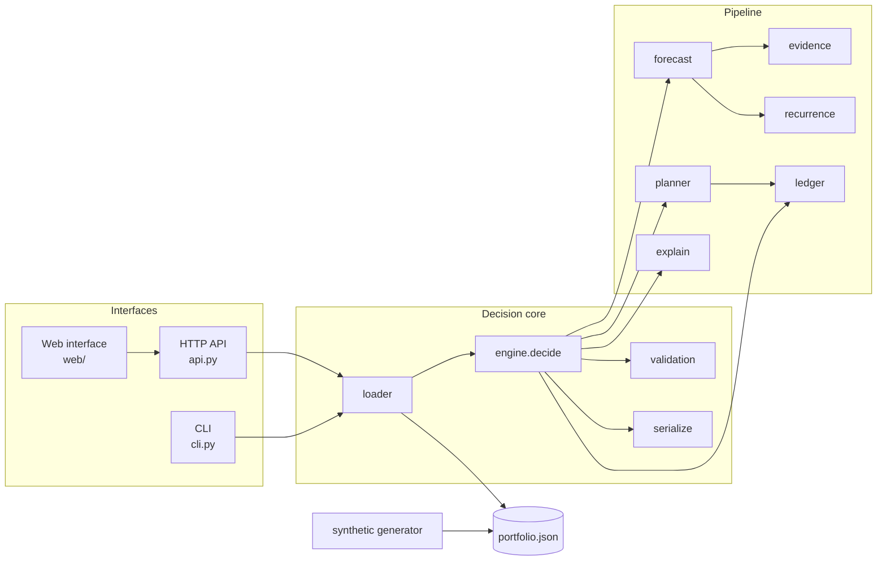
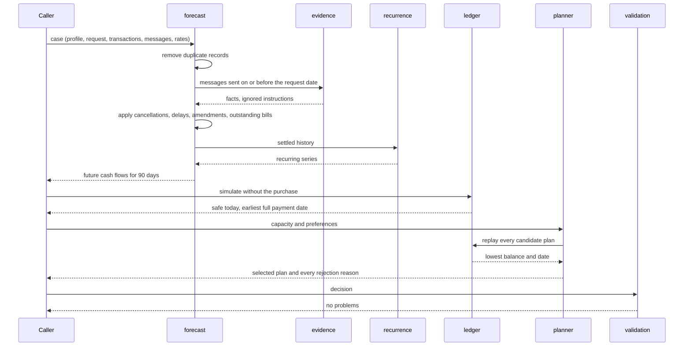

# Architecture

Trevad is a Python package with three ways in: a command-line tool, an HTTP
API, and a web interface served by that API. All three call the same
`decide(case)` function. There is no database and no network call inside a
decision.

## Modules

| Module | Responsibility |
| --- | --- |
| `trevad/models.py` | Plain data classes: profile, transaction, message, request, cash flow, candidate plan, decision |
| `trevad/loader.py` | Reads the JSON data format and turns it into models, with clear errors for bad input |
| `trevad/money.py` | Decimal helpers, rounding, month arithmetic, exchange-rate table |
| `trevad/evidence.py` | Reads messages and extracts facts: cancellations, delays, amendments, income changes, rent rises |
| `trevad/recurrence.py` | Finds monthly, weekly, and fortnightly patterns in settled history |
| `trevad/forecast.py` | Removes duplicates, applies facts, builds the list of future cash flows |
| `trevad/ledger.py` | Day-by-day balance simulation and capacity (safe today, earliest full payment) |
| `trevad/planner.py` | Builds candidate plans, replays each one, searches spending changes, ranks the safe plans |
| `trevad/explain.py` | Writes the plain-language explanation from the chosen plan |
| `trevad/engine.py` | `decide(case)`: runs the pipeline and returns a `Decision` |
| `trevad/validation.py` | Checks a decision against the rules without reusing the planner |
| `trevad/serialize.py` | JSON and CSV output |
| `trevad/synthetic.py` | Seeded demo data generator |
| `trevad/cli.py` | `generate`, `decide`, `explain`, `serve` |
| `trevad/api.py` | FastAPI application and static web files |
| `trevad/web/` | Single-page interface: request list, decision, forecast chart, plans, evidence |

## Component view

## One decision, step by step

## Design boundaries

**Messages change cash flows, never decisions.** A message can cancel a
charge, move a salary, or raise a bill. It cannot choose a plan or skip the
safety replay. Text that reads like an instruction to the system is recorded
as ignored.

**Exact money.** Every amount is a `Decimal`. Safe amounts are rounded down to
the cent, so rounding never makes an unsafe payment look safe.

**Every plan is replayed.** A plan is only recommended after the full 90-day
simulation shows the balance never drops below the user's minimum.

**Independent validation.** `validation.py` checks the result against the
request, the profile, and the supplied options without calling the planner.
The CLI and API refuse to return a decision that fails validation.

**Deterministic.** The same input always gives the same output. The demo
generator is seeded for the same reason.
